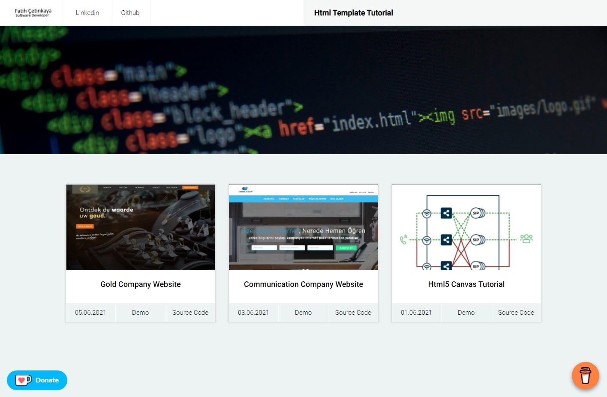

# Html Responsive Templates
I have prepared a project for those who want to get started with Html and for beginners.


## Table of contents
* [General info](#general-info)
* [Screenshots](#screenshots)
* [Demo](#demo)
* [Projects](#Projects)
* [Code Examples](#code-examples)

## General info
I have prepared a project for those who want to get started with Html and for beginners. You can find the codes and sample pages of this project on github.

## Screenshots



## Demo
https://html-templates-responsive.firebaseapp.com/

## Projects
1. Gold Company - Responsive Template
2. Communication Company - Responsive Template
3. Html5 Canvas - ISP Shema 


## Code Examples
Show examples of usage:
```
// Rectangle Line
	{"x1": 170 , "y1": 292 , "x2": 170 ,  "y2": 145 ,  "color": green }, // Rectangle Line Up	-	1
	{"x1": 170 , "y1": 145 , "x2": 220 ,  "y2": 145 ,  "color": green }, // Rectangle Line Up-Right	-	2
	{"x1": 240 , "y1": 145 , "x2": 300 ,  "y2": 145 ,  "color": green }, // Rectangle Line Up-Right	-	3
	{"x1": 240 , "y1": 145 , "x2": 300 ,  "y2": 145 ,  "color": green }, // Rectangle Line Up-Right	-	4
	{"x1": 360 , "y1": 145 , "x2": 460 ,  "y2": 145 ,  "color": green }, // Rectangle Line Up-Right	-	5
	{"x1": 540 , "y1": 145 , "x2": 672 ,  "y2": 145 ,  "color": green }, // Rectangle Line Up-Right	-	6
	{"x1": 670 , "y1": 145 , "x2": 670 ,  "y2": 292 ,  "color": green }, // Rectangle Line Up-RightDown	-	7
	{"x1": 670 , "y1": 288 , "x2": 670 ,  "y2": 437 ,  "color": green }, // Rectangle Line Down-Right	-	8
	{"x1": 470 , "y1": 435 , "x2": 670 ,  "y2": 435 ,  "color": green }, // Rectangle Line Down-Left	-	9
    {"x1": 360 , "y1": 435 , "x2": 460 ,  "y2": 435 ,  "color": green }, // Rectangle Line Down-Left	-	10
    {"x1": 240 , "y1": 435 , "x2": 300 ,  "y2": 435 ,  "color": green }, // Rectangle Line Down-Left	-	11
	{"x1": 170 , "y1": 435 , "x2": 220 ,  "y2": 435 ,  "color": green }, // Rectangle Line Down-Left	-	12	
	{"x1": 170 , "y1": 437 , "x2": 170 ,  "y2": 290 ,  "color": green }, // Rectangle Line Down-Left	-	13	
	

```
